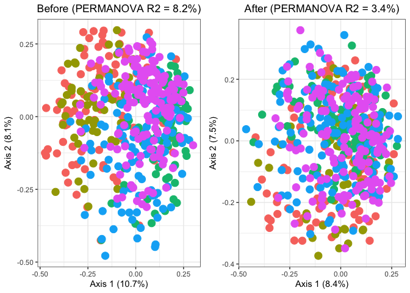
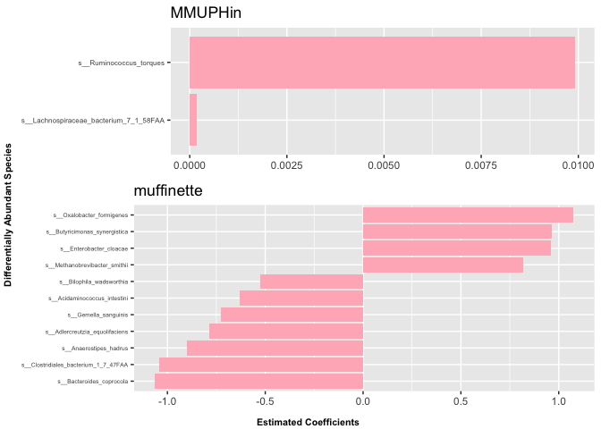

# muffinette - Meta-analysis of differential multi-omics networks

The repository houses the **`muffinette`** R package for multi-study
meta-analysis of multi-omics differential netwirks.

## Dependencies

`muffinette` requires the following `R` package: `devtools` (for
installation only). Please install it before installing `muffinette`,
which can be done as follows (execute from within a fresh R session):

    install.packages("devtools")
    library(devtools)

## Installation

Once the dependencies are installed, `muffinette` can be loaded using
the following command:

    devtools::install_github("himelmallick/muffinette", quiet = TRUE)
    library(muffinette)

## Example Implementation

We showcase the effectiveness of our network-connectivity-based
meta-analytic approach (muffinette) by drawing a comparison with
feature-abundance-based meta-analysis (MMUPHin) based on the CRC data
available through the R package `MMUPHin`. This data consists of species
level relative abundance profiles of CRC and control patients in the
five public studies used in Thomas et al. (2019). The dataset is sourced
from the R package `curatedMetagenomicData`.

### Data Pre-processing

    rm(list=ls())
    library(dplyr)
    ## 
    ## Attaching package: 'dplyr'
    ## The following objects are masked from 'package:stats':
    ## 
    ##     filter, lag
    ## The following objects are masked from 'package:base':
    ## 
    ##     intersect, setdiff, setequal, union
    library(MMUPHin)
    library(muffinette)
    library(vegan)
    ## Loading required package: permute
    ## 
    ## Attaching package: 'permute'
    ## The following object is masked from 'package:devtools':
    ## 
    ##     check
    library(ggplot2)
    library(cowplot)
    library(ggpubr)
    ## 
    ## Attaching package: 'ggpubr'
    ## The following object is masked from 'package:cowplot':
    ## 
    ##     get_legend

    data("CRC_abd", "CRC_meta")

    set.seed(2310)

    data_meta <- data.frame(sampleID = colnames(CRC_abd),
                            age = CRC_meta$age,
                            gender = as.factor(CRC_meta$gender),
                            response = CRC_meta$study_condition,
                            study = as.factor(CRC_meta$studyID))

    data_abd <- CRC_abd # feature-by-sample matrix
    rownames(data_meta) <- colnames(data_abd)

    filtered_featuretable <- muffinette::filter_abdfeatures(x = t(data_abd),
                                                            abd_threshold = 0,
                                                            prev_threshold = 0.1)
    filtered_featuretable <- muffinette::filter_varfeatures(x = filtered_featuretable, topV = NULL)

    meta_abd_mat <- t(as.matrix(filtered_featuretable)) ## feature-by-sample matrix

### Batch (Study) Effect Correction

    batch_corrected_abd <- MMUPHin::adjust_batch(feature_abd = meta_abd_mat,
                                                 batch = "study",
                                                 covariates = "response",
                                                 data = data_meta)$feature_abd_adj
    ## feature_abd is proportions
    ## Found 5 batches
    ## Adjusting for 1 covariate(s) or covariate(s) level(s)
    ## Pseudo count is not specified and set to half of minimal non-zero value: 5e-08
    ## Adjusting for (after filtering) 232 features
    ## Standardizing data across features
    ## Estimating batch difference parameters and EB priors
    ## Performing shrinkage adjustments on batch difference parameters
    ## Performing batch corrections

### Visualization of Batch (Study) Effect Correction

    D_before <- vegan::vegdist(t(meta_abd_mat))
    D_after <- vegan::vegdist(t(batch_corrected_abd))

    fit_adonis_before <- vegan::adonis2(D_before ~ study, data = data_meta)
    fit_adonis_after <- vegan::adonis2(D_after ~ study, data = data_meta)

    print(fit_adonis_before)
    ## Permutation test for adonis under reduced model
    ## Permutation: free
    ## Number of permutations: 999
    ## 
    ## vegan::adonis2(formula = D_before ~ study, data = data_meta)
    ##           Df SumOfSqs      R2      F Pr(>F)    
    ## Model      4   13.503 0.08202 12.196  0.001 ***
    ## Residual 546  151.130 0.91798                  
    ## Total    550  164.633 1.00000                  
    ## ---
    ## Signif. codes:  0 '***' 0.001 '**' 0.01 '*' 0.05 '.' 0.1 ' ' 1
    print(fit_adonis_after)
    ## Permutation test for adonis under reduced model
    ## Permutation: free
    ## Number of permutations: 999
    ## 
    ## vegan::adonis2(formula = D_after ~ study, data = data_meta)
    ##           Df SumOfSqs      R2      F Pr(>F)    
    ## Model      4    5.405 0.03385 4.7822  0.001 ***
    ## Residual 546  154.276 0.96615                  
    ## Total    550  159.681 1.00000                  
    ## ---
    ## Signif. codes:  0 '***' 0.001 '**' 0.01 '*' 0.05 '.' 0.1 ' ' 1

    ##############
    # Ordination #
    ##############
    # Before
    R2_before <- round(fit_adonis_before$R2[1]*100, 1)
    pcoa_before <- cmdscale(D_before, eig = TRUE)
    ord_before <- as.data.frame(pcoa_before$points)
    percent_var_before <- round(pcoa_before$eig / sum(pcoa_before$eig) * 100, 1)[1:2]
    before_labels <- c(paste('Axis 1 (', percent_var_before[1], '%)', sep = ''), 
                       paste('Axis 2 (', percent_var_before[2], '%)', sep = ''))

    before_phrase <- paste('Before (PERMANOVA R2 = ', R2_before, '%)', sep = '')
    colnames(ord_before) <- c('PC1', 'PC2')
    ord_before$Study <- data_meta$study

    # After
    R2_after <- round(fit_adonis_after$R2[1]*100, 1)
    pcoa_after <- cmdscale(D_after, eig = TRUE)
    ord_after <- as.data.frame(pcoa_after$points)
    percent_var_after <- round(pcoa_after$eig / sum(pcoa_after$eig) * 100, 1)[1:2]
    after_labels <- c(paste('Axis 1 (', percent_var_after[1], '%)', sep = ''), 
                      paste('Axis 2 (', percent_var_after[2], '%)', sep = ''))

    after_phrase <- paste('After (PERMANOVA R2 = ', R2_after, '%)', sep = '')
    colnames(ord_after) <- c('PC1', 'PC2')
    ord_after$Study <- data_meta$study

    # Ordination Plot
    p_before <- ggplot(ord_before, aes(x = PC1, y = PC2, color = Study)) + 
        geom_point(size = 4) + 
        theme_bw() + 
        xlab(before_labels[1]) + 
        ylab(before_labels[2]) + 
        ggtitle(before_phrase) + 
        theme(plot.title = element_text(hjust = 0.5)) + 
        theme(legend.position ="none")

    p_after <- ggplot(ord_after, aes(x = PC1, y = PC2, color = Study)) + 
        geom_point(size = 4) + 
        theme_bw() + 
        xlab(after_labels[1]) + 
        ylab(after_labels[2]) + 
        ggtitle(after_phrase) + 
        theme(plot.title = element_text(hjust = 0.5)) + 
        theme(legend.position ="none")

    p <- plot_grid(p_before, p_after, ncol = 2)
    p

### Meta-analysis of feature abundance data (MMUPHin)

    out_mmuphin <- MMUPHin::lm_meta(feature_abd = batch_corrected_abd,
                                exposure = "response",
                                batch = "study",
                                data = data_meta, control = list(forest_plot = "forest.pdf",
                                                                 normalization = 'NONE',
                                                                 transform = 'NONE'))
    ## Found 5 batches
    ## Fitting Maaslin2 on batch FengQ_2015.metaphlan_bugs_list.stool...
    ## Fitting Maaslin2 on batch HanniganGD_2017.metaphlan_bugs_list.stool...
    ## Fitting Maaslin2 on batch VogtmannE_2016.metaphlan_bugs_list.stool...
    ## Fitting Maaslin2 on batch YuJ_2015.metaphlan_bugs_list.stool...
    ## Fitting Maaslin2 on batch ZellerG_2014.metaphlan_bugs_list.stool...
    ## Fitting meta-analysis model.

    metafits_mmuphin <- out_mmuphin$meta_fits
    selected_features_mmuphin <- out_mmuphin$meta_fits[out_mmuphin$meta_fits$qval.fdr < 0.05, 1]
    selected_features_mmuphin
    ## [1] "s__Ruminococcus_torques"               
    ## [2] "s__Lachnospiraceae_bacterium_7_1_58FAA"

### Meta-network-analysis (muffinette)

    batchvar <- data_meta$study
    exposurevar <- data_meta$response

    out_muffinette <- muffinette::muffinette(metaAbd = batch_corrected_abd,
                                    batchvar = batchvar, exposurevar = exposurevar,
                                    metaData = data_meta,
                                    filter = TRUE, abd_threshold = 0, prev_threshold = 0.1, topfeatures = NULL,
                                    batchCorrect = TRUE, count = FALSE, net.est.method = "SparCC",
                                    covariates = NULL, ncores = 4, verbose = TRUE, fixseed = 2310, iter = 20, inner_iter = 10, th = 0.1)
    ## feature_abd is proportions
    ## Found 5 batches
    ## Adjusting for 1 covariate(s) or covariate(s) level(s)
    ## Pseudo count is not specified and set to half of minimal non-zero value: 1.26e-07
    ## Adjusting for (after filtering) 232 features
    ## Standardizing data across features
    ## Estimating batch difference parameters and EB priors
    ## Performing shrinkage adjustments on batch difference parameters
    ## Performing batch corrections
    ## Batch correction done...
    ## Registered S3 methods overwritten by 'huge':
    ##   method    from
    ##   plot.roc  pROC
    ##   plot.sim  lava
    ##   print.roc pROC
    ##   print.sim lava
    ## Network estimated for study 1 / 5
    ## Network estimated for study 2 / 5
    ## Network estimated for study 3 / 5
    ## Network estimated for study 4 / 5
    ## Network estimated for study 5 / 5
    ## Found 5 batches
    ## Fitting Maaslin2 on batch FengQ_2015.metaphlan_bugs_list.stool...
    ## Fitting Maaslin2 on batch HanniganGD_2017.metaphlan_bugs_list.stool...
    ## Fitting Maaslin2 on batch VogtmannE_2016.metaphlan_bugs_list.stool...
    ## Fitting Maaslin2 on batch YuJ_2015.metaphlan_bugs_list.stool...
    ## Fitting Maaslin2 on batch ZellerG_2014.metaphlan_bugs_list.stool...
    ## Fitting meta-analysis model.
    ## expo: exposure
    ## value_expo: CRC
    ## Meta-analysis done...

    metafits_muffinette <- out_muffinette$metafits
    selected_features_muffinette <- out_muffinette$metafits[out_muffinette$metafits$qval < 0.05, 1]
    selected_features_muffinette
    ##  [1] "s__Butyricimonas_synergistica"       
    ##  [2] "s__Clostridiales_bacterium_1_7_47FAA"
    ##  [3] "s__Anaerostipes_hadrus"              
    ##  [4] "s__Oxalobacter_formigenes"           
    ##  [5] "s__Gemella_sanguinis"                
    ##  [6] "s__Adlercreutzia_equolifaciens"      
    ##  [7] "s__Bilophila_wadsworthia"            
    ##  [8] "s__Enterobacter_cloacae"             
    ##  [9] "s__Acidaminococcus_intestini"        
    ## [10] "s__Bacteroides_coprocola"            
    ## [11] "s__Methanobrevibacter_smithii"

### Comparison of the Two Meta-Analysis Approaches

    fig_mmuphin <- metafits_mmuphin %>%
      filter(qval.fdr < 0.05) %>%
      mutate(feature = sub("^species:", "", feature)) %>%
      arrange(coef) %>% 
      mutate(feature = factor(feature, levels = feature)) %>%
      ggplot(aes(y = coef, x = feature)) +
      geom_bar(stat = "identity", fill = "lightpink") +
      coord_flip() +
      theme(axis.text.y = element_text(size = 6)) +
      labs(y = NULL, x = NULL,
           title = "MMUPHin")

    fig_muffinette <- metafits_muffinette %>%
      filter(qval < 0.05) %>%
      mutate(feature = sub("^species:", "", feature)) %>%
      ggplot(aes(y = coef, x = reorder(feature, coef))) +
      geom_bar(stat = "identity", fill = "lightpink") +
      coord_flip() +
      theme(axis.text.y = element_text(size = 5)) +
      labs(y = NULL, x = NULL, title = "muffinette")

    fig <- ggarrange(fig_mmuphin, fig_muffinette, nrow = 2, heights = c(0.75, 1))
    fig <- annotate_figure(fig,
                           left = text_grob("Differentially Abundant Species",
                                            size = 8, face = "bold", rot = 90),
                           bottom = text_grob("Estimated Coefficients",
                                              size = 8, hjust = 0.5, face = "bold"))
    fig

